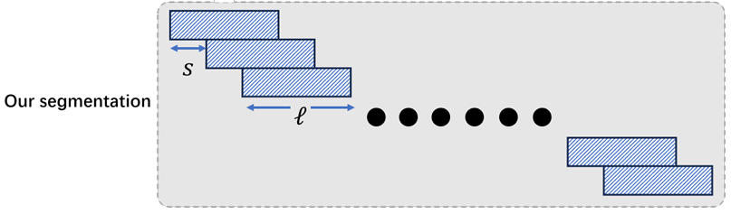

# LIFT: Improving Long Context Understanding Through Long Input Fine-Tuning

## Introduction

> TODO

## Quick Start

> TODO

You can follow the following example to implement LIFT w/o auxiliary tasks.

First load the training dataset. `ContextDataset` in `lift.context_dataset` helps you to construct the training dataset from the context string `context`. The meaning of `block_size, len_segment, len_offset` is illustrated in the following figure.



```python
from lift.context_dataset import ContextDataset

dataset = ContextDataset(
    context=context_str,
    tokenizer=tokenizer,
    model_max_length=model_max_length,
    block_size=block_size,
    len_segment=len_segment,    # ell = block_size * len_segment
    len_offset=len_offset       # s = block_size * len_offset
)
```

Then load the pretrained LLM. `load_model` from `lift.model` specifies the hyperparameters needed to load the model. `vocab_size` is the vocabulary size of the tokenizer. If it's large than the LLM's default vocabulary size, the LLM will adapt to it; you can assign it as `None`.

```python
from lift.model import load_model

model = load_model(
    model_name_or_path=model_name_or_path,
    use_lora=use_lora,
    lora_rank=lora_rank,
    load_in_4bit=load_in_4bit,
    load_in_8bit=load_in_8bit,
    vocab_size=vocab_size
)
```

At last, call `train` from `lift.train` to start LIFT. Besides `model`, `dataset` and `tokenizer`, you should provide the training hyperparameters (provided by Huggingface `transformers`) and `gather_batches`.

By default, we assign `gather_batches=True`. This means that the trainer will batch all the samples in an epoch into a single epoch (implemented with gradient accumulation).


```python
from lift.train import train

model = train(
    model=model,
    dataset=dataset,
    tokenizer=tokenizer,
    training_args=training_args,
    gather_batches=True,
)
```